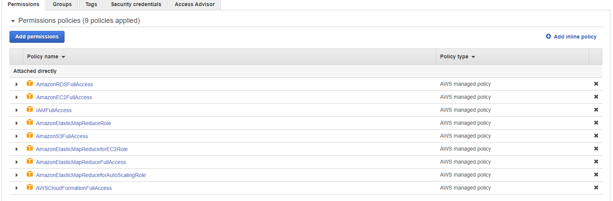
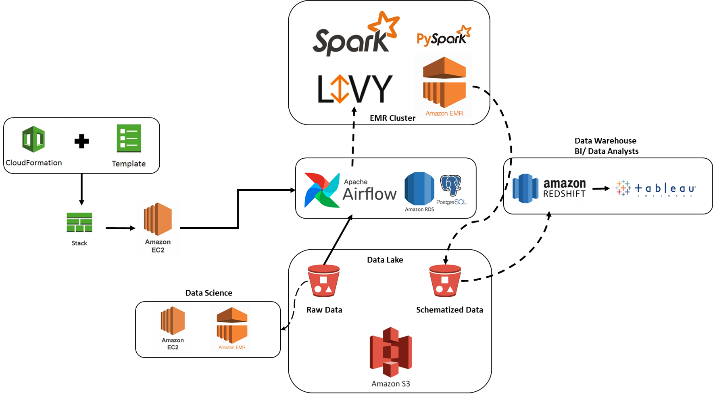

## Capstone Project
The purpose of this cpastone project is to demonstrate various data engineering skills acquired with the nanodegree. This capstone project mainly focuses on the following key areas:
- Developing ETL/ELT pipelines using Apache Airflow
- Constructing Data Lakes in S3 for raw data or for staging purposes
- Using AWS EMR and pyspark to transform raw data
- Constructing Redshift DWH from the staging/schematized data in AWS S3
- Analyzing the Data using pyspark in a Jupyter Notebook

This project is for demonstration purposes and will make use of the following data sources

#### Data Sources from Udacity
- **I94 Immigration Data**: This data comes from the US National Tourism and Trade Office found [here](https://travel.trade.gov/research/reports/i94/historical/2016.html). Each report contains international visitor arrival statistics by world regions and select countries (including top 20), type of visa, mode of transportation, age groups, states visited (first intended address only), and the top ports of entry (for select countries)
- **U.S. City Demographics Data**: This dataset contains information about the demographics of all US cities and census-designated places with a population greater or equal to 65,000. Dataset comes from OpenSoft found [here](https://public.opendatasoft.com/explore/dataset/us-cities-demographics/export/).
- **Airport Codes**: This is a simple table of airport codes and corresponding cities. The airport codes may refer to either IATA airport code, a three-letter code which is used in passenger reservation, ticketing and baggage-handling systems, or the ICAO airport code which is a four letter code used by ATC systems and for airports that do not have an IATA airport code (from wikipedia). It comes from [here](https://datahub.io/core/airport-codes#data)
#### External Data Sources
I have enriched the dataset using the following data sources to make the analysis more useful and more informative

- **Port of Entry/Nationality Codes**: This dataset contains information about various of port of entry codes which would be used to join the data in the I94 immigration data. The nationality codes contain the country abbreviations [Port Codes; Nationality Codes And Port of Entry codes](https://fam.state.gov/fam/09FAM/09FAM010205.html)
- **US Visa Types**: This data is extracted from the US DHS and Wikipedia which would give information on various visa types offered by US [US Non-immigrant Visa Types](https://www.dhs.gov/immigration-statistics/nonimmigrant/NonimmigrantCOA) and [US Immigrant Visa Types](https://en.m.wikipedia.org/wiki/Visa_policy_of_the_United_States#Classes_of_visas)
- **Airline Codes**: This data source consists of airlines IATA abbreviations and the country of origin [Airline Codes](https://www.iata.org/en/about/members/airline-list?page=30&search=&ordering=Alphabetical)

#### Creating AWS CloudFormation Stack

In order to run this project the following resources are needed:
- `AWS EC2` - a `m4.xlarge` instance is needed for executing `Apache Airflow`
- `Apache Airflow` - for orchestrating the ETL pipeline
- `AWS RDS` - for Airflow to store its metadata
- `AWS S3` - for creating the Data Lake
- `AWS EMR` - cluster with `Apache Spark` and `Apache Livy` are needed to perform `Transformation` tasks on the raw data

To make the provisioning of the above resources easier, I have used the `AWS Cloudformation` to create
the stack needed for running this project.

The resources needed are already configured in the [airflow_server](./airflow_server_v3.yaml) yaml file

To start creating the resources the following steps are to be performed:
1) Create an `AWS` account and provide necessary billing information
2) Create a `user` from `AWS IAM`
3) For the `user` make sure the following permissions are provided in IAM

4) Finish the `user` creation step and  download the `AWS KEY ID` and `AWS SECRET` into a `csv` file
5) Create an `EC2 Key Pair` for accessing the EC2 instance for using `Airflow`
6) After finishing the above steps. Fill in the `dwh.cfg` with your details
7) Finally to create the cloud-formation stack use: `python create_resources.py`

#### Project Architecture
The following project architecture is used for developing the Data Lake and DWH in AWS

- Run the `python create_resources.py` to create the Airflow EC2 instances
- Once the EC2 instance is created, log in to the instance using PuTTY and then run `bash start_airflow.sh` to start airflow at `<ec2_instance_ip>:8080`
- Use your browser to open airflow with address `<ec2_instance_ip>:8080` and Airflow Home would list the following dags
    - `Metadata_transform_dag` - This DAG will extract all the information for creating the dimension tables in the DWH
    - `Immigration_transform_dag` - This DAG will extract the `I94 immigration SAS data` and stores the processed files in parquet format in S3
    - `Create_DWH_dag`- This DAG will use the staging bucket in S3 to create a DWH in AWS Redshift

##### Code References
1) [Developing Cloud Formation Script](https://github.com/aws-samples/aws-concurrent-data-orchestration-pipeline-emr-livy.git)
2) [Data pipeline Orchestration with Airflow, Spark and Livy](https://aws.amazon.com/blogs/big-data/build-a-concurrent-data-orchestration-pipeline-using-amazon-emr-and-apache-livy/)
