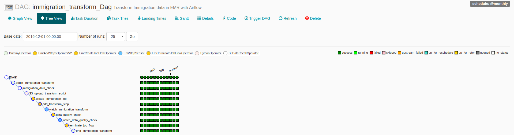

## Capstone Project
The purpose of this cpastone project is to demonstrate various data engineering skills acquired with the nanodegree. This capstone project mainly focuses on the following key areas:
- Developing ETL/ELT pipelines using Apache Airflow
- Constructing Data Lakes in S3 for raw data or for staging purposes
- Using AWS EMR and pyspark to transform raw data
- Constructing Redshift DWH from the staging/schematized data in AWS S3
- Analyzing the Data using pyspark in a Jupyter Notebook

This project is for demonstration purposes and will make use of the following data sources

### Data Sources from Udacity
- **I94 Immigration Data**: This data comes from the US National Tourism and Trade Office found [here](https://travel.trade.gov/research/reports/i94/historical/2016.html). Each report contains international visitor arrival statistics by world regions and select countries (including top 20), type of visa, mode of transportation, age groups, states visited (first intended address only), and the top ports of entry (for select countries)
- **U.S. City Demographics Data**: This dataset contains information about the demographics of all US cities and census-designated places with a population greater or equal to 65,000. Dataset comes from OpenSoft found [here](https://public.opendatasoft.com/explore/dataset/us-cities-demographics/export/).
- **Airport Codes**: This is a simple table of airport codes and corresponding cities. The airport codes may refer to either IATA airport code, a three-letter code which is used in passenger reservation, ticketing and baggage-handling systems, or the ICAO airport code which is a four letter code used by ATC systems and for airports that do not have an IATA airport code (from wikipedia). It comes from [here](https://datahub.io/core/airport-codes#data)
### External Data Sources
I have enriched the dataset using the following data sources to make the analysis more useful and more informative

- **Port of Entry/Nationality Codes**: This dataset contains information about various of port of entry codes which would be used to join the data in the I94 immigration data. The nationality codes contain the country abbreviations [Port Codes; Nationality Codes And Port of Entry codes](https://fam.state.gov/fam/09FAM/09FAM010205.html)
- **US Visa Types**: This data is extracted from the US DHS and Wikipedia which would give information on various visa types offered by US [US Non-immigrant Visa Types](https://www.dhs.gov/immigration-statistics/nonimmigrant/NonimmigrantCOA) and [US Immigrant Visa Types](https://en.m.wikipedia.org/wiki/Visa_policy_of_the_United_States#Classes_of_visas)
- **Airline Codes**: This data source consists of airlines IATA abbreviations and the country of origin [Airline Codes](https://www.iata.org/en/about/members/airline-list?page=30&search=&ordering=Alphabetical)

#### Creating AWS CloudFormation Stack

In order to run this project the following resources are needed:
- `AWS EC2` - a `m4.xlarge` instance is needed for executing `Apache Airflow`
- `Apache Airflow` - for orchestrating the ETL pipeline
- `AWS RDS` - for Airflow to store its metadata
- `AWS S3` - for creating the Data Lake
- `AWS EMR` - cluster with `Apache Spark` and `Apache Livy` are needed to perform `Transformation` tasks on the raw data

To make the provisioning of the above resources easier, I have used the `AWS Cloudformation` to create
the stack needed for running this project.

The resources needed are already configured in the [airflow_server](./airflow_server_v3.yaml) yaml file

To start creating the necessary resources the following steps are to be performed:
1) Create an `AWS` account and provide necessary billing information (if needed)
2) Create a `user` from `AWS IAM`
3) For the `user` make sure the following permissions are provided in IAM

4) Finish the `user` creation step and  download the `AWS KEY ID` and `AWS SECRET` into a `csv` file
5) Create an `EC2 Key Pair` with name **`airflow_key_pair`** for accessing the EC2 instance for using `Airflow`
6) After finishing the above steps. Fill in the `dwh.cfg` with your details (aws key and secret)
7) Finally to create the cloud-formation stack use: `python create_resources.py`


#### Project Architecture
The following project architecture is used for developing the Data Lake in AWS


Using the data from the Data Lake in S3 which is considered as Staging Bucket here the following DWH Star schema is finalized:


##### Setting up Airflow and AWS Connections
1) Create an S3 bucket for raw data and upload [airflow_server](./airflow_server_v3.yaml) file into the bucket
2) Fill the [dwh.cfg](./dwh.cfg) file with your AWS details and also fill the [dwh_airflow.cfg]('./plugins/helpers/dwh_airflow.cfg')
3) Run the `python create_resources.py` to create the Airflow EC2 instance
    - This script uploads raw data bucket into the bucket with name for eg. `dend-capstone-data` (created in step 1.)
    - Python scripts are also uploaded into the raw data bucket. (Look at the S3 folder structure below)
    - Creates a Staging Bucket with name for eg. `dend-capstone-staging` in S3
    - Creates a AWS EC2 instance with `Airflow` installed in it
4) Once the EC2 instance is created, log in to the instance using PuTTY and then run `bash ~/start_airflow.sh` to start airflow at `<ec2_instance_ip>:8080`
5) Use your browser to open airflow with address `<ec2_instance_ip>:8080` and Airflow Home would list the following dags
    - `metadata_transform_dag` - This DAG will extract all the information for creating the dimension tables in the DWH
    - `immigration_transform_dag` - This DAG will extract the `I94 immigration SAS data` and stores the processed files in parquet format in S3
    - `create_DWH_dag`- This DAG will use the staging bucket in S3 to create a DWH in AWS Redshift
    
6) Fill in the new `aws_credentials` in `Connections` page like the picture below:

7) Fill in the new `redshift` connection details as well:


##### S3 folder Structure
This is S3 folder structure for both RAW and STAGING buckets
```
<RAW DATA BUCKET> 
│   airflow_server_v3.yaml 
│
└───awsemr/
│   │   bootstrap_action.sh
│   
└───python_apps/
│    │   data_lake_quality_check.py
│    │   transform_immigration.py
│
└───raw/
│    └───codes/
│        │   airlines-codes.csv
│        │   airport-codes.csv
│        │   nationality-codes.csv
│        │   port-of-entry-codes.csv
│    └───i94_immigration_data/
│        │   *.sas7bdat
│    └───sas_meta_data/
│        │   I94_SAS_Labels_Descriptions.SAS
│    └───us-demogrpahics/
│        │   us-cities-demographics.csv
│    └───us-visa/
│        │   visa-type.csv
│        │   visa-issuing-ports.csv

<STAGING DATA BUCKET>  
└───lake/
│   └───codes/
│        │   airlines-codes/*.parquet
│        │   airport-codes/*.parquet
│        │   nationality-codes/*.parquet
│        │   port-of-entry-codes/*.parquet
│   └───demogrpahics/
│        │   *.parquet
│   └───i94_meta_data/
│        │   ... extracted sas labels *.parquet
│   └───immigration/
│        │   month_year=apr_16/*.parquet
│        │   .....
│   └───visa-type/
│        │   *.parquet
│   └───visa-issue-post/
│        │   *.parquet
```

#### Executing the DAGS
- Use the Airflow UI to trigger dags
- First trigger the DAG - `metadata_transform_dag`. This DAG will spin up `EMR` cluster and use `Apache Livy` REST interface to perform the necessary transformations and the data quality checks


- Then execute the `immigration_transform_dag`. This DAG will also spin up `EMR` cluster but will use the `EMR add steps` method to basically add the transformation steps defined
for obtaining transformed SAS immigration data. This DAG has a `monthly` schedule and can start at a particular point of time and finish at another




- Once both the DAGS are completed then `S3 Staging area (Data Lake)` is ready. Then the `DWH`can be created in the Redshift
- Execute the `capstone_DWH_dag` to fill the DWH with the tables and data


#### Alternative Data Scenarios
The project rubric asked how alternative scenarios may be tackled. A discussion of these is included below.

**Data increased by 100x:**
- I have used AWS EMR (elastic) with Spark this helps when processing of huge data throughput is needed. 
- The SAS data is already partitioned by month and year, this would help with querying in Spark.
- The remaining meta data is stored in parquet format which can be processed with spark in a distributed way
- I am using parquet format for all the tables in S3 Data Lake, therefore from staging to DWH the transfer would be faster.
- I have used S3 for storing Staging and Raw data, the main advantage is S3's scalability and accessibility with other AWS infrastructure.

**The pipelines would be run on a daily basis by 7 am every day:** 
- In this scenario an additional Airflow DAG should be implemented to transfer the data from Udacity workspace to AWS S3 to meet the SLA. The existing Airflow DAGs would have to change the schedule interval from `monthly` to `daily`. 

**Database needed to be accessed by 100+ people:**
- I have already chosen Redshift as a DWH which have auto-scaling capabilities and good read performance. To manage efficient user access different `user` groups
should be defined accordingly. This would restrict write access for the users who would need only read access and for `admin` users full access is provided

#### Conclusion

This capstone project was used to demonstrate the steps involved in building a Data Lake and DWH in AWS
- Creating AWS resources using AWS Cloudformation - IaC
- Creating S3 buckets, Redshift Cluster, IAM Roles, Security groups
- Developing an ELT Pipeline that transforms raw data from S3 buckets into staging buckets in S3 using AWS EMR
- Developing an ETL pipeline to copy data from S3 staging area to AWS Redshift
- Using Airflow and Python to automate ETL pipelines
- Writing custom operators to perform tasks such as S3 Data checks, copying data from S3 to Redshift and EMR add steps
- Transforming data from various sources into a star schema optimized for the immigration analysts use cases.

##### Code References
1) [Developing Cloud Formation Script](https://github.com/aws-samples/aws-concurrent-data-orchestration-pipeline-emr-livy.git)
2) [Data pipeline Orchestration with Airflow, Spark and Livy](https://aws.amazon.com/blogs/big-data/build-a-concurrent-data-orchestration-pipeline-using-amazon-emr-and-apache-livy/)
